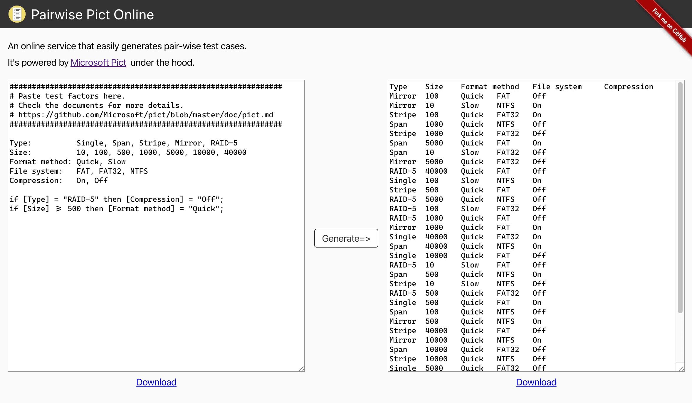

# **Motivation**

I recently learned about the [pairwise test method](http://www.pairwise.org/).

It seems to be a technique to prevent the test cases from becoming huge.

There is [Microsoft Pict](https://github.com/microsoft/pict) as a famous CLI tool for generating pairwise test cases, but you have to compile it on your computer from source codes.

# **Outcome**

So, I created a online tool for creating pairwise test cases. It's powered by Microsoft Pict under the hood.

[https://pairwise.yuuniworks.com](https://pairwise.yuuniworks.com/)

You can simply pass test elements to the left side and you'll get results. Ta-dah!

Happy Coding! :)