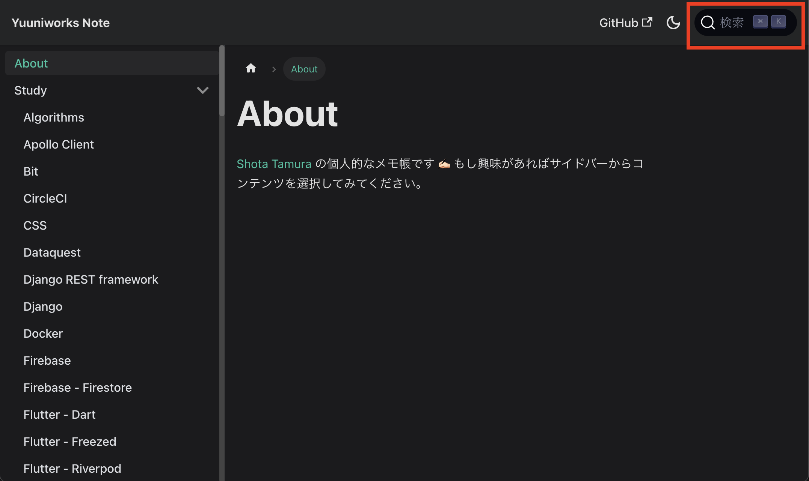
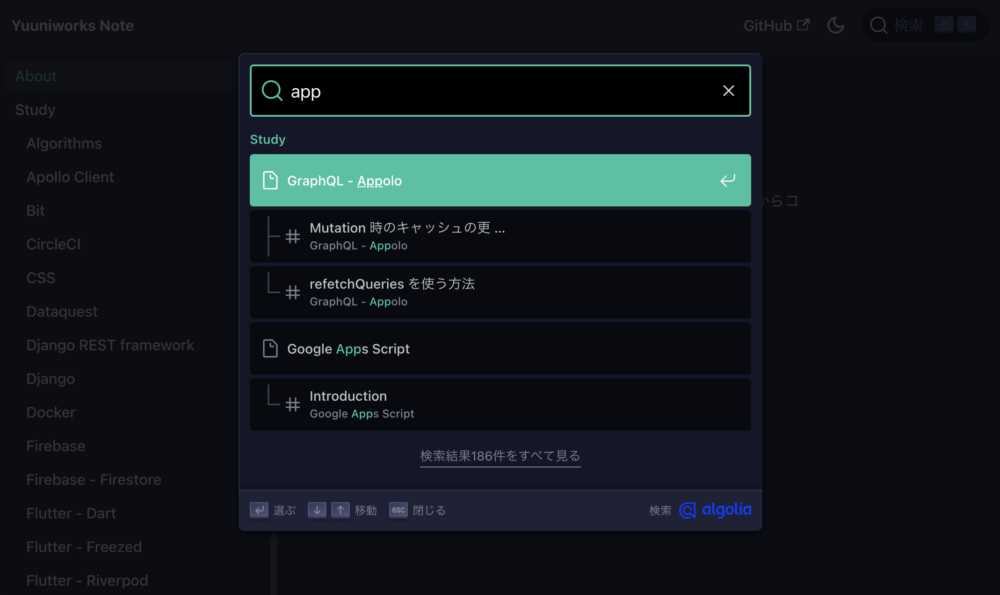
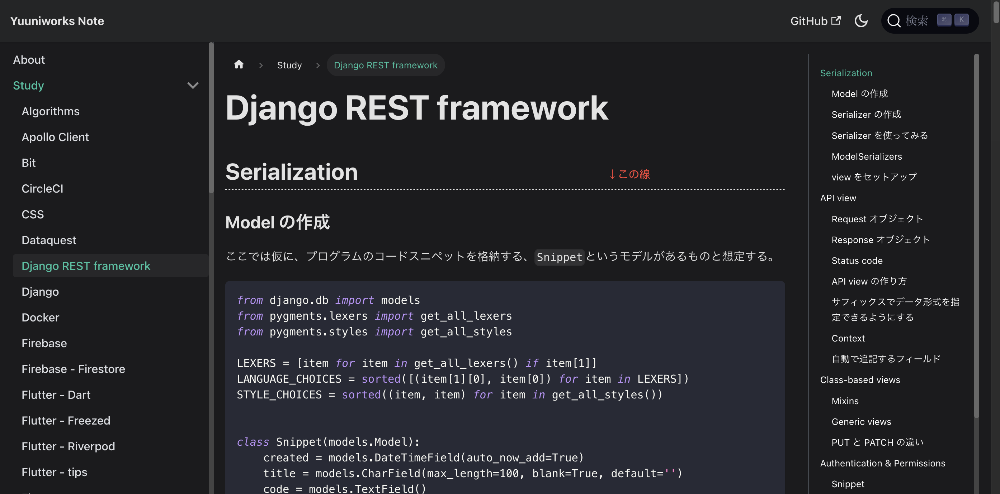
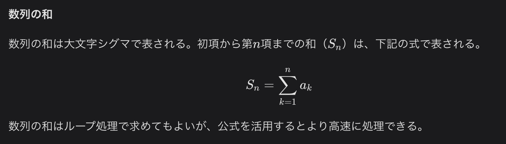

## 概要

VuePressで作っていたサイトをDocuSaurusに移行しました！

## 背景

私は物事をすぐに忘れる性格なので、学んだことは全てマークダウンファイルにまとめたうえで、Webに公開してきました。

これまで、Webへの公開には[VuePress](https://vuepress.vuejs.org/)を活用していたのですが、既にバージョンが古くなっており移行が必要な状態でした。

仕事ではReactばかり使用しており、特にVueに思い入れもないので、Reactを使ってVuePressと似たようなことをできるものはないか探してみました。色々調べてみると、Metaが作っている[DocuSaurus](https://docusaurus.io/)というライブラリが良さそうだという結論になり、このたび移行を行いました。

## 結果

- 旧サイト：[https://nifty-austin-a38e05.netlify.app](https://nifty-austin-a38e05.netlify.app/)
- 新サイト：[https://note.yuuniworks.com](https://note.yuuniworks.com/about)

## 移行してどうだったか

- ダークモードに対応できて嬉しかったです
- Algolia Searchによる全文検索機能が死んでいたのですが、復活して嬉しかったです
- Reactで書けるようになって嬉しかったです

## カスタマイズ内容

DocuSaurusは基本的にマークダウンファイルをぶっこむだけでサイトを作成できます。とはいえ、いくつかのカスタマイズは必要だったので備忘として以下に記載しておきます。

### Algolia Seachによる全文検索を可能にする

[公式ドキュメント](https://docusaurus.io/docs/search#using-algolia-docsearch)に沿って手続きを行うことで実装できました。

技術文書かつGithubで公開されているリポジトリなら無料で使うことができます。

```jsx
// docusaurus.config.js
const config = {
  themeConfig: {
    algolia: {
      appId: 'Algoliaから',
      apiKey: 'メールで届いたキーなどを',
      indexName: 'ここに書き込む',
    },
  },
};
```

全文検索が有効になると右上に検索ボックスが表示されます。



ボックスに文字を打ち込むとこんな感じで全ドキュメント内から該当箇所を探し出してくれます。これで、ニワトリ級の記憶力しかない私でも生きていけるようになります。最高です。



### `docs`パスをなくす

デフォルトではURLにdocsというパスが入るのですが、私の場合はルートパスで直接アクセスしたかったので、所要の修正を行いました。

- [`https://hogehoge.com/docs/my-markdown`](https://hogehoge.com/docs/my-markdown) (こうではなく)
- [`https://hogehoge.com/my-markdown`](https://hogehoge.com/my-markdown) (こうしたい)

```jsx
// docusaurus.config.js
const config = {
  presets: [
    [
      'classic',
      {
        docs: {
          routeBasePath: '/', // ←コレを追加
        },
      },
    ],
  ],
};
```

### ランディングページを使わない

サイトの性質上、ランディングページは不要であり、いきなり文書の一覧を表示させたかったので、ルートページからのアクセスは`about.md`という個別ページへリダイレクトするようにしました。

サーバレベルでの設定はVercelのコンフィグにて行いました。

```jsx
// vercel.json
{
  "redirects": [{ "source": "/", "destination": "/about" }]
}
```

クライアントレベルでのリダイレクトはhooksで行いました。

```jsx
// index.tsx
import React, { useEffect } from 'react';
import useDocusaurusContext from '@docusaurus/useDocusaurusContext';
import Layout from '@theme/Layout';
import { useHistory } from '@docusaurus/router';

export default function Home(): JSX.Element {
  const { siteConfig } = useDocusaurusContext();
  const history = useHistory();

  useEffect(() => {
    history.push('/about'); // ←コレ
  }, []);

  return <Layout description={siteConfig.tagline}></Layout>;
}
```

### H2レベルの見出しに下線を入れる

文書の見出しに階層があるとき、デフォルトでは文字の大きさでのみ違いが表現されているのですが、自分の場合はそれだけだとどこにいるか分からなくなるので、スタイルを少し変更しました。

```css
/* src/css/custom.css */
.markdown > h2 {
  border-bottom: 1px var(--ifm-color-content) dotted;
  padding-bottom: 0.3rem;
}
```



### 数式を入力できるようにKatexを導入

一部のページで数式を表示するため、katexを導入しました。

```jsx
const config = {
  presets: [
    [
      'classic',
      {
        docs: {
          remarkPlugins: [math], // ←コレと
          rehypePlugins: [[katex, { strict: false }]], // ←コレ
        },
      },
    ],
  ],
};
```

これで数式が表示できるように！(機械学習の文脈で数学を勉強しなおしていた時期があったのですが結局なにもわからんかった)



### サイドバーの並び順調整

サイドバーの並びを手動で調整しました。

マークダウン内で並び順を設定する方法↓

```markdown
---
sidebar_position: 1 # ←コレ
title: About
---

コンテンツはここに書きます。
```

カテゴリ（フォルダ）の並び順を設定する方法↓

```json
# _category_.json というファイルをカテゴリフォルダに置いて、以下を記述します
{
  "position": 2,  # ←コレ
}
```

### Google Analytics 4の導入

以下だけです。楽勝です。

```jsx
const config = {
  presets: [
    [
      'classic',
      {
        gtag: {
          trackingID: 'G-X4XKDEQ71K',
          anonymizeIP: true,
        },
      },
    ],
  ],
};
```

### その他細々とした修正

- サイトのTitle, Description, Logoの設定
- ダークモードはシステム設定を見るように
- 各ページの下部に表示される前後ページへのリンクを削除
- フッターの削除
- ロケールを明示的に`ja`に設定
- `Edit Me!`的なGithubへのリンクを削除

## まとめ

たまに新しい仕組みを使うとフレッシュな気持ちになれていいですね。

ドキュメントページを立ち上げる時、非技術者だとNotionで作ったりするのが流行だと思いますが、技術者ならGitで管理したいとかマークダウンで書きたい気持ちがあると思います。そういう時、DocuSaurusは手間がかからずおすすめですので、ぜひお試しあれ！
