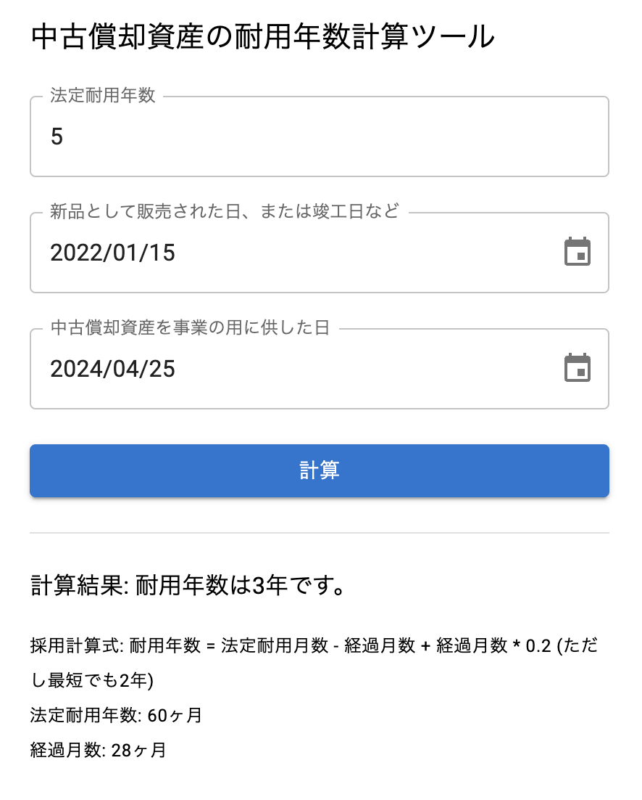

全国の個人事業主の皆様！中古で買った償却資産の耐用年数を計算するの、地味に面倒ですよね。

私は毎回やり方を忘れてめんどくせ〜〜〜〜と頭を掻きながらネット検索しつつ計算しておりました。しかし、いい加減いやになったので自動で計算してくれるツールを作りました。

**中古償却資産の耐用年数計算ツール**

[http://durable-years.yuuniworks.com/](http://durable-years.yuuniworks.com/)

こういうのをカッとなって作っているときが一番テンションが上がるんですよね。