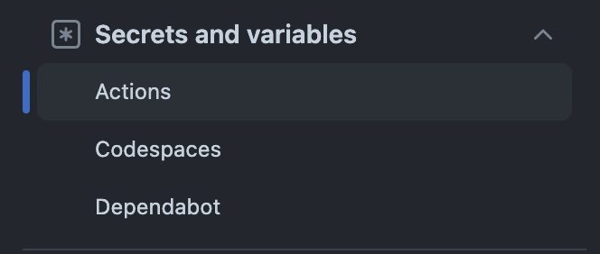
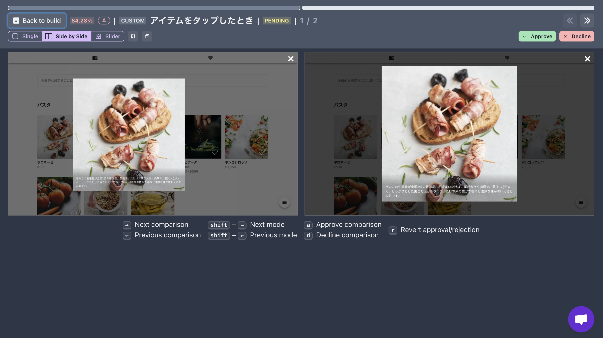

個人プロジェクトでVRTの仕組みを整える機会があったのでメモ。

# 作戦1: Playwright + Git LFSのパターン

まずはPlaywrightの[`toHaveScreenshot()`](https://playwright.dev/docs/api/class-pageassertions#page-assertions-to-have-screenshot-1)だけを活用してVRTができるか挑戦してみた。`toHaveScreenshot()`を活用する場合、原則としてgitリポジトリにベースライン画像と呼ばれる正とされる画像をコミットする必要がある。素朴に画像をコミットするとリポジトリが肥大化するため、Git LFSを併用することとした。

## Git LFSの設定

インストール

```bash
# 初期設定
brew install git-lfs
git lfs install
git lfs version # git-lfs/3.5.1 (GitHub; darwin arm64; go 1.22.1)
```

管理対象の設定

```bash
# どんなファイルをlfsで管理すべきか検討するときに便利なコマンド
# (以下の例では1MB以上のファイルを列挙)
find . -size +1M -ls

# lfsで管理したいファイルの種別を指定する
git lfs track "tests/snapshots/**/*.png"

# 設定がちゃんとできたか確認する。実際には.gitattributesに設定値が書き込まれている。
git lfs track 

# 管理対象となっている実際のファイルを一覧で見る
git lfs ls-files
```

## Playwrightの設定

スナップショットファイルの書き出し先をPlaywrightの設定ファイルに書いておく。デフォルトだとプラットフォーム名(darwin,linux)などがファイル名の末尾に入ってしまい、Mac上で生成したベースライン画像ファイル名と差異が出ることで、CIが失敗するため。

```bash
snapshotPathTemplate: 'tests/snapshots/{testFileName}/{arg}{ext}'
```

## GitHub Actionsの設定

Git LFSをGithub Actionsで利用する場合は、以下のようにcheckoutする必要がある。このため、Playwrightを実行しているActionsに以下を記載しておく。

```bash
- uses: actions/checkout@v4
	with:
	  lfs: true
```

上記以外の設定は、Playwrightが生成するデフォルトの設定などに沿った。

## 結果

作戦1を試した結果、いくつか問題があった。

- Git LFSの仕組み上、一度コミットした画像は事実上、永遠に消せない。VRTの画像はPRレビュー時にのみ必要なものであり、マージ後は不要になる。不要な画像に生涯お金を払い続けるのは、辛い。
- MacとCIの実行環境による差分を解消できなかった。全く同じコンテナを使ってDocker上で画像を生成することも試してみたが、フォントのレンダリングや隙間に微妙な差異が発生してしまい、お手上げだった。

# 作戦2: Lost Pixelを使う

新進気鋭の[Lost Pixel](https://www.lost-pixel.com/)というサービスがニーズに合っていそうなので試してみた。

## Playwrightの設定

テスト実行時には、`page.toHaveScreenshot()`を使って指定したフォルダに画像を生成する。以下のようなutilを作っておくと便利。

```tsx
export const takeScreenshot = async (
  page: Page,
  name: string,
) => {
  await expect(page).toHaveScreenshot(`${name}.png`, {/* オプション設定が必要ならここに */});
};
```

Lost Pixelは単一のフォルダ内の画像しか見てくれないので、Playwrightも単一のフォルダにスナップショット画像を作成してくれるように、以下のような設定をする。

```tsx
// playwright.config.ts
snapshotPathTemplate:
  'tests/lost-pixel/{testFileName}-{arg}-{projectName}-{platform}.png',
```

テスト実行時には常に`—update-snapshots`オプションをつけて実行する。

```tsx
// package.json
"test:e2e": "npx playwright install && npx playwright test --update-snapshots"
```

このようにすることで、Playwright自体は単にスナップショット画像を生成する責務だけに専念し、画像比較や承認の責務はLost Pixelに丸投げすることができる。なお、`page.screenshot()`という関数もあるが、こちらは諸々の機能が劣るので素直に`page.toHaveScreenshot()`を使ったほうが便利。

## Lost Pixelの設定

まずはコンフィグファイルの生成と、必要なライブラリをインストールする。

```yaml
npx lost-pixel init-ts
npm i -D lost-pixel
```

コンフィグファイル(`lostpixel.config.ts`)はこんな感じで書く。

```yaml
import { CustomProjectConfig } from 'lost-pixel';

export const config: CustomProjectConfig = {
  customShots: {
    # Playwrightが画像を出力するフォルダ
    currentShotsPath: './tests/lost-pixel',
  },
  lostPixelProjectId: '<my_lost_pixel_project_id>',
  # Github Actions(と必要に応じてDependabot)のシークレットに入れておくのを忘れずに
  apiKey: process.env.LOST_PIXEL_API_KEY,
};
```

## Github Actionsの設定

Playwrightを実行する後段で以下のアクションを走らせるだけ。

```yaml
- name: Lost Pixel
  uses: lost-pixel/lost-pixel@v3.16.0
  env:
    LOST_PIXEL_API_KEY: ${{ secrets.LOST_PIXEL_API_KEY }}
```

なお、Dependabotでも上記ワークフローを動作させたい場合の話として、DependabotはActionsのシークレットにはアクセスできないという落とし穴に注意。対処法としては、Dependabotのシークレットにも重複して値を登録しておくか、Actionsのトリガーをpull_requestではなくpull_request_targetにする必要がある。詳細略。



ActionsのSecretとDependabotのSecretは、別々に管理できるようになっている

## 結果

これだけで、VRTの差分確認から承認までを一気通貫して行えるプラットフォームが用意される。



承認画面の例

ベースライン画像は、祖先のコミットにおける承認履歴を勘案しつつ、最も適切なものが自動でピックアップされる。

このあたりのロジックは若干理解しきれていないところではあるものの、少なくともシングルトンなベースライン画像置き場みたいなものがあるわけではないことは確認済み。おそらく、「コミット x 画像 x 承認」の組み合わせをクラウド上に保持しており、祖先から最も直近の承認済みのものをピックアップしているのだろう。

(サポートに聞いてみたら「そうなんよ、そのへんのロジックはみんなが思うほど簡単じゃないんよ😂 わかりやすい表現ができるように改善中だよ！」って英語で言ってた。)

私のニーズに限れば、「PRマージ前にLost Pixelでの承認を必須とする + PRマージ時には最新のメインブランチへのリベースを必須とする」という設定にしておけば、狙い通りに機能しそうだ。

というわけで、作戦1で抱えていた問題をすべてキレイに解消できたので、作戦2でしばらく言ってみることにした。

2024/08現在で、7,000枚までの比較なら無料なので、個人プロジェクト等では枠を超えることはなさそう。とりあえず失うものはないし、諸々のコストが非常に低く抑えられるので、みなさま活用されたい。