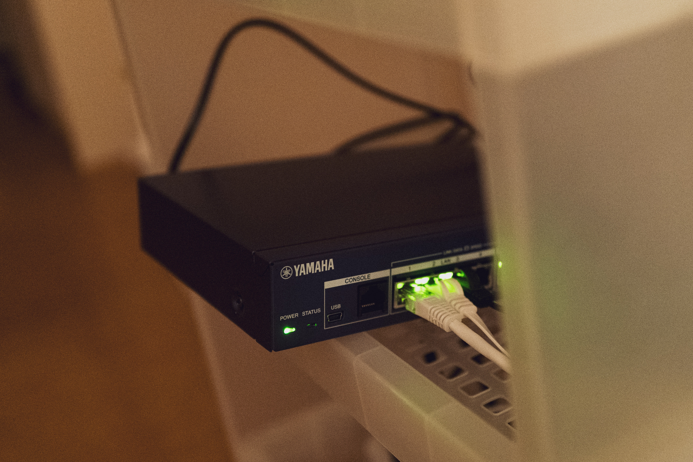
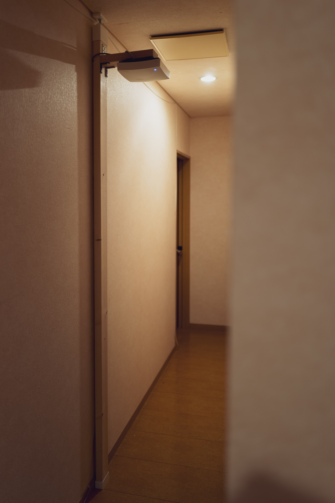
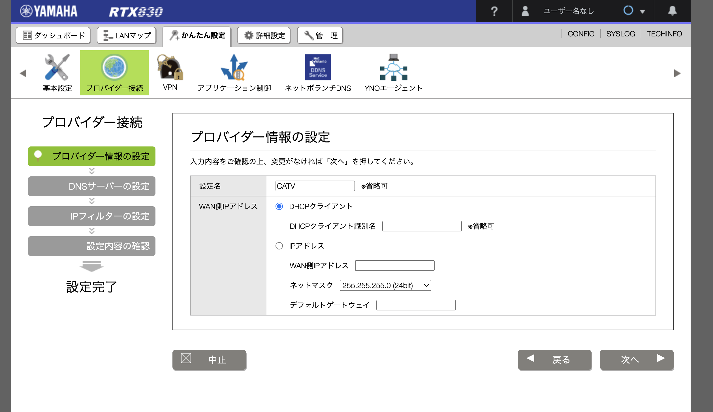
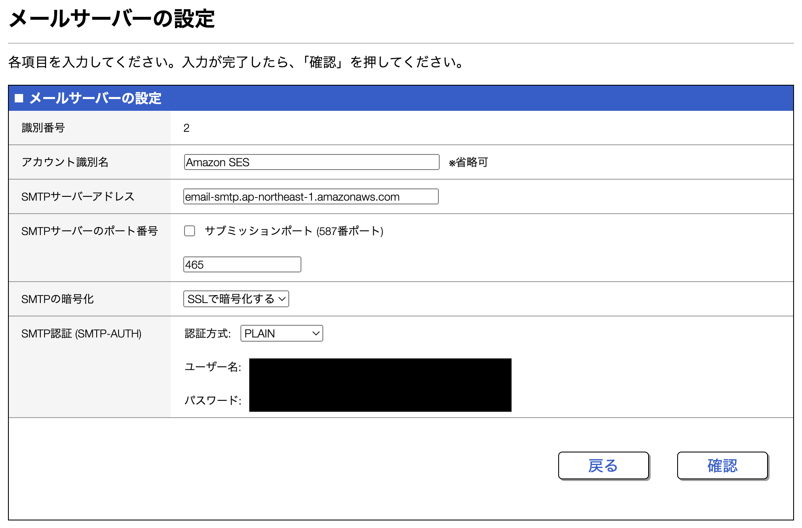

回線の安定化のため、YAMAHAの[RTX830](https://network.yamaha.com/products/routers/rtx830/index)と[WLX323](https://network.yamaha.com/products/wireless_lan/wlx323/index)を導入した。やったことのメモなどを残しておく。



↑そのへんの棚に雑然と放り込まれてもプロフェッショナルな光を放つRTX830



↑廊下の天井付近に設置されたWLX323の図（背後のはただの換気扇）。ときに、この[2x4材でなんでも作れるやつ](https://www.amazon.co.jp/%E5%B9%B3%E5%AE%89%E4%BC%B8%E9%8A%85%E5%B7%A5%E6%A5%AD-DIY%E5%8F%8E%E7%B4%8D%E3%83%91%E3%83%BC%E3%83%84-2%C3%974%E3%82%A2%E3%82%B8%E3%83%A3%E3%82%B9%E3%82%BF%E3%83%BC%E5%BC%B7%E5%8A%9B%E3%82%BF%E3%82%A4%E3%83%97-EXO-1-%E6%9C%80%E5%A4%A7%E4%BD%BF%E7%94%A8%E8%8D%B7%E9%87%8D40kg/dp/B083WKG6JH/ref=sr_1_1_sspa?__mk_ja_JP=%E3%82%AB%E3%82%BF%E3%82%AB%E3%83%8A&crid=119A9B1PX82T8&dib=eyJ2IjoiMSJ9.k8_YfmMU1ByhZ410M_o8gIN2bgS9umqmLoG8NQgt9uHLAzNNqBjuM5zW-XRtzlk-9aL-vcih09OFaUnAQwTUm5a5pOpwDL1rBO0U0Vc6N74xVCng8nXpcP664Bxn7qhC7yDiTErW2eBvSTMA0C8QKVtV-eSaiz57pTYEHsHsd8yVsxOhqvVdSHupXtb4Wiqzs91QPidav5-GGk-dqvKXH3zSD0KLn_WfZhizfH4m9_kWt8YXS5usgAX5Ymn9iO9-S0OIaGIgucwaLSVkGVwmLQww8t6WGJqJtD8935AgXEw.sydBBr4d7KLAtqDBX9f-BLi2sBSm4nTkeNe1MW6XXxs&dib_tag=se&keywords=2x4&qid=1740977783&sprefix=2x4%2Caps%2C174&sr=8-1-spons&sp_csd=d2lkZ2V0TmFtZT1zcF9hdGY&psc=1)ほんとベンリーノ。

# 初期IPなど

ルーターの初期IPは192.168.100.1

アドレス範囲は192.168.100.0/24

無線APのIPはDHCP

# まずはルーターにSerial(USB)で接続

シリアルで繋げられる環境を整えておくとトラブル時にも安心なので、初めにやる。RTX830はUSB接続での接続が可能。Macでも問題なく動作する。

まずはデバイスを探す。

```bash
% ls /dev/tty.*
```

すると、以下のように表示される。

```bash
/dev/tty.BLTH
/dev/tty.usbmodem14101 # こんなやつがターゲットだ！
/dev/tty.Bluetooth-Incoming-Port
```

screenコマンドを使って、シリアル通信を行う。

```bash
% screen /dev/tty.usbmodem14101
```

終了するには`ctrl + a, k`を押す。

# 設定の基本作法

コンソールに何らかの方法で接続したのち

```bash
% administrator # 設定変更のためにまずは管理者に切り替える
% (何らかの設定をしたのちに)
% show config # 現在の設定を見る
% save # 設定を保存する。これしないと再起動時に全部戻る。
% quit
```

# 文字コードの設定

macのscreenコマンドで繋ぐと文字化けするので、sjisからutf8に変更しておく。

```bash
console character ja.utf8
```

# パスワードの設定

```bash
login password # ログインパスワードをプロンプトで設定する
administrator password # 管理者パスワードをプロンプトで設定する
```

# SSHの有効化

毎回USBで繋ぐのは面倒なのでSSHで繋げるようにしておく。

```bash
% login user myName mySecretPassword # SSH用の一般ユーザーを作る
% sshd host key generate # サーバー側の鍵を作っておく。これ以上何もしなくてOK。
% sshd service on # SSHサービスを起動する
% sshd host lan1 # lanからのアクセスのみ認める
% import sshd authorized-keys myName # 事前に作成したクライアント側の公開鍵である~/.ssh/id**.pubの内容を貼り付ける。これで毎回パスワードを聞かれなくて済む。
```

公式マニュアル↓

[https://www.rtpro.yamaha.co.jp/RT/manual/rt-common/howtouse/ssh_server.html](https://www.rtpro.yamaha.co.jp/RT/manual/rt-common/howtouse/ssh_server.html)

# Telnetの無効化

SSHの環境を整えた暁には、危険なTelnetさんを抹殺しておく。

```bash
telnetd service off # telnetサービスを起動しない
no telnet host # 接続元の制限を削除
```

# WANの設定

流石に煩雑なのでGUIで行った。といってもWAN側は単純なDHCPである。



# セキュリティ設定

WAN側との入出力に関するルーティング設定についてはWAN設定の際に自動で設定されるが、少しだけ手直しした。WAN側のプライベートアドレスへのアクセスやその逆を完全に禁じるなど。これもGUIから設定可能。

- 設定例
    
    ```bash
    ip lan2 secure filter in 101000 101001 101002 101003 101020 101021 101022 101023 101024 101025 101030
    ip lan2 secure filter out 101010 101011 101012 101013 101020 101021 101022 101023 101024 101025 101026 101027 101099 dynamic 101080 101081 101082 101083 101084 101085 101098 101099
    ip lan2 nat descriptor 200
    ip filter 101000 reject 10.0.0.0/8 * * * *
    ip filter 101001 reject 172.16.0.0/12 * * * *
    ip filter 101002 reject 192.168.0.0/16 * * * *
    ip filter 101003 reject 192.168.100.0/24 * * * *
    ip filter 101010 reject * 10.0.0.0/8 * * *
    ip filter 101011 reject * 172.16.0.0/12 * * *
    ip filter 101012 reject * 192.168.0.0/16 * * *
    ip filter 101013 reject * 192.168.100.0/24 * * *
    ip filter 101020 reject * * udp,tcp 135 *
    ip filter 101021 reject * * udp,tcp * 135
    ip filter 101022 reject * * udp,tcp netbios_ns-netbios_ssn *
    ip filter 101023 reject * * udp,tcp * netbios_ns-netbios_ssn
    ip filter 101024 reject * * udp,tcp 445 *
    ip filter 101025 reject * * udp,tcp * 445
    ip filter 101026 restrict * * tcpfin * www,21,nntp
    ip filter 101027 restrict * * tcprst * www,21,nntp
    ip filter 101030 pass * 192.168.100.0/24 icmp * *
    ip filter 101031 pass * 192.168.100.0/24 established * *
    ip filter 101032 pass * 192.168.100.0/24 tcp * ident
    ip filter 101033 pass * 192.168.100.0/24 tcp ftpdata *
    ip filter 101034 pass * 192.168.100.0/24 tcp,udp * domain
    ip filter 101035 pass * 192.168.100.0/24 udp domain *
    ip filter 101036 pass * 192.168.100.0/24 udp * ntp
    ip filter 101037 pass * 192.168.100.0/24 udp ntp *
    ip filter 101099 pass * * * * *
    ip filter 500000 restrict * * * * *
    ip filter dynamic 101080 * * ftp
    ip filter dynamic 101081 * * domain
    ip filter dynamic 101082 * * www
    ip filter dynamic 101083 * * smtp
    ip filter dynamic 101084 * * pop3
    ip filter dynamic 101085 * * submission
    ip filter dynamic 101098 * * tcp
    ip filter dynamic 101099 * * udp
    ```
    

# DHCPの動作モードを調整

`dhcp server rfc2131 compliant except remain-silent` という初期設定が入っているが、トラブルになる場合もあるらしいので消しておく。RFC2131の標準動作になるだけなので、問題ないはず。

参考 https://wiki.mgmn.jp/?Logbook/DHCP%E3%82%B5%E3%83%BC%E3%83%90%E3%81%AE%E5%86%97%E9%95%B7%E5%8C%96%E3%81%A7%E3%83%8F%E3%83%9E%E3%81%A3%E3%81%9F%E8%A9%B1

また、DHCPサーバーがクライアントを識別するときにMACアドレスではなくClient Identifierというものを使うようになっているが、これもトラブルの元なのでやめる。

https://qiita.com/hoto17296/items/7f1e7783f703904248de

これらをまとめると以下の一行になる。

```bash
dhcp server rfc2131 compliant except use-clientid
```

# 無線APのSSID構成

YAMAHAの無線APにはVirtual Access Point (VIP)という機能があり、最大16個のSSIDを任意の設定で作ることができる。SSIDの設計にあたり求めた要件は以下のとおり。

- 2.4GHzはなるべく使いたくない
- 複数のバンド帯域をまとめることで、端末側でよしなに自動選択できる様にしたい（ただし2.4GHz帯は除く）
- なるべく最新のセキュリティ規格を使いたい

これをふまえ、最終的には以下の4つのSSIDを使う構成にした。

1. **6GHz/5GHz × WPA3**
    - メインのSSID。特に支障がないかぎり基本的にこのSSIDを使う。
    - 6GHzと他のバンドを束ねるには、規格の制約上、WPA3が必須である点に注意。Mix Modeでは束ねられない。
    - 2.4GHz帯は含めていない。混雑していてカオスだし、範囲もそれほど広がらず、メリットがないため。
2. **5GHz × WPA2**
    - 5GHz帯は利用できるものの、WPA2にのみ対応しているIoT機器向けのSSID。
3. **2.4GHz × WPA3** / **WPA2** Mix Mode
    - 2.4GHz帯のみ利用できるIoT機器向けのSSID。
4. **2.4GHz × WPA2** Mix Mode
    - Mix Modeだと正常に動作しない💩端末が一台だけあり、それ専用のSSID。早々に無くしたい。

# メール通知の有効化

YAMAHAのルーターにはL2MSという機器監視の仕組みがあり、異常発生時にはメールで通知することもできる。Amazon SESと連携して通知する仕組みにした。

設定画面では`465`番ポート、SMTP-AUTHは`PLAIN`にしておけばOK。



# わかったこと

- 5GHz帯と比べると、6GHz帯は本当に電波が飛ばない。安定して使うには同じ部屋の内での利用が限界で、二階建て一軒家を1台のAPでカバーしようとしてもうまくいかない。とくにスマートフォンはノートPCと比べて電波感度が弱く、5GHzで繋いだほうがマシという状況が発生する。
- YAMAHA独自のローミング機能をオンにしていると電波が弱くなったときに自動でバスバス接続をAP側から切られるので、無効化した。一軒家だとほぼすべての部屋がAPと壁越しのアクセスになり、そんなに電波は強くないため。
- YAMAHAは情報公開がすごい。しかも全てちゃんとメンテナンスされている。
    - コマンドの打ち方は阿部寛のホームページに網羅されているし → https://www.rtpro.yamaha.co.jp/RT/manual/rt-common/
    - ログメッセージの意味は事細かに説明されているし → https://www.rtpro.yamaha.co.jp/AP/docs/wlx323/log_reference.html
    - 技術資料もそこまで公開していいんすかレベルだし → https://www.rtpro.yamaha.co.jp/AP/docs/wlx323/white-paper.html
