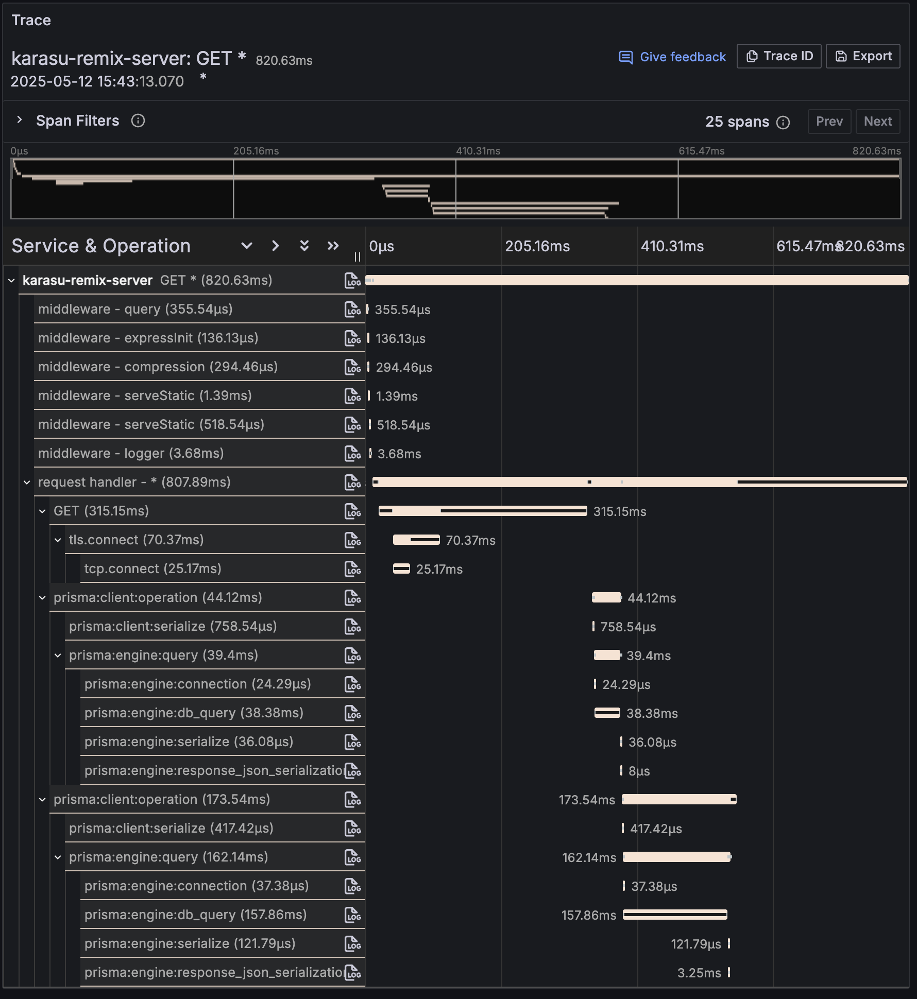
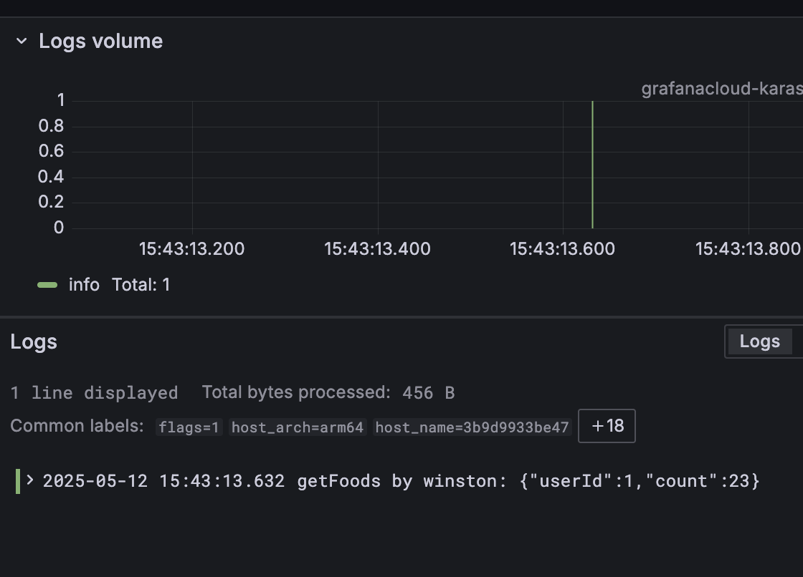
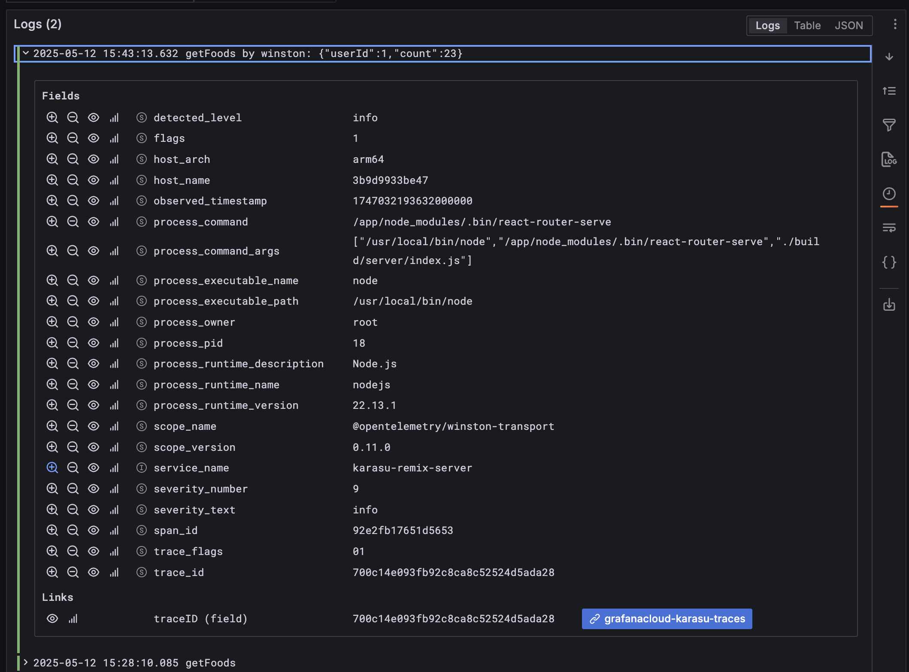
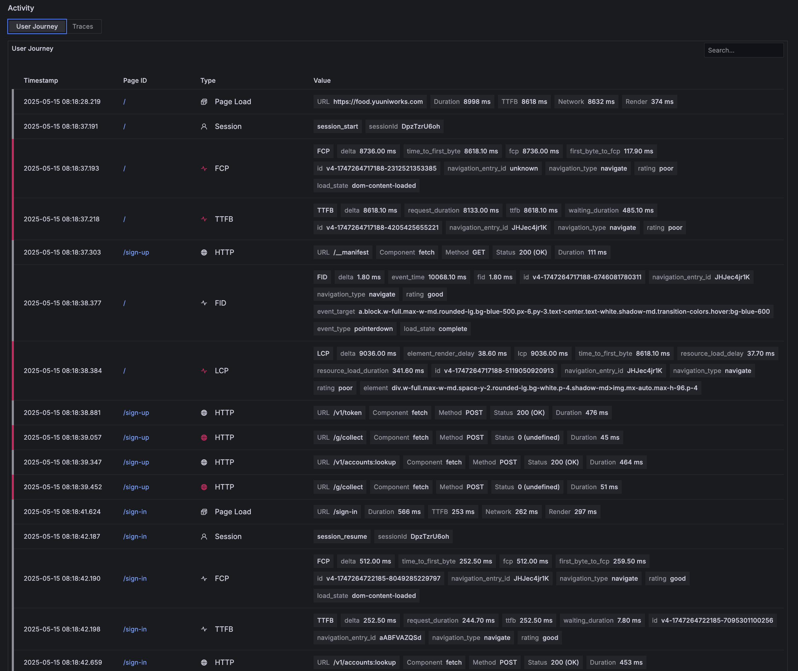
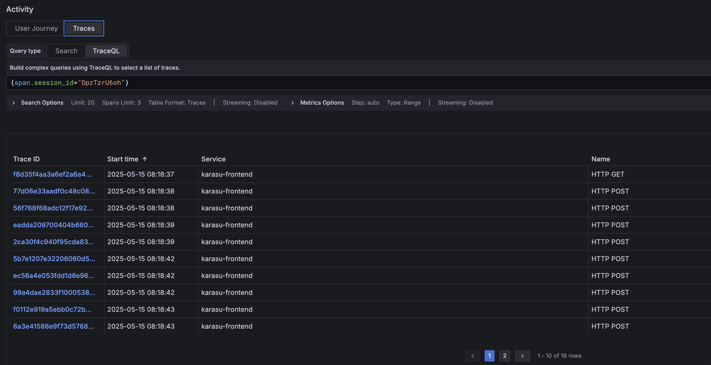
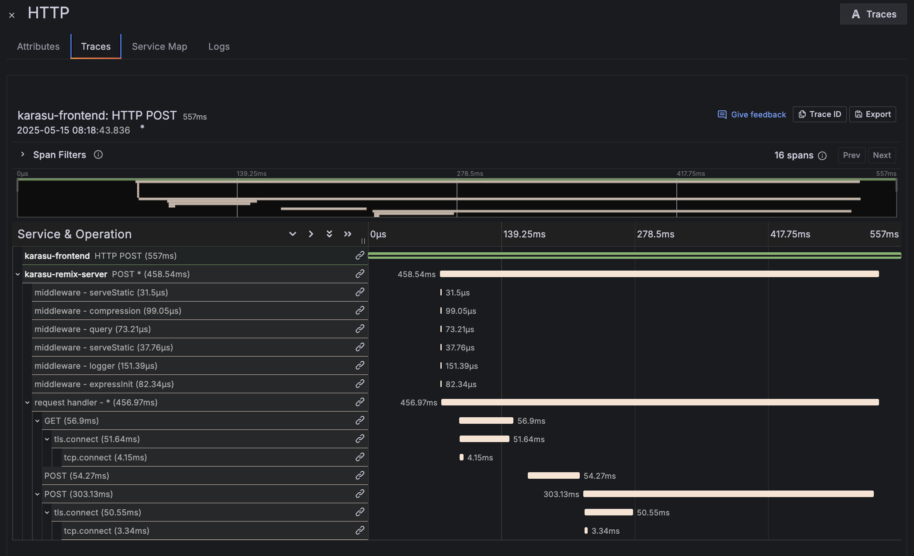

小規模サービスで最低限のオブザーバビリティをコスパよく実現する方法として、これまではNew Relicを使用してきた。しかし最近はOpenTelemetryやGrafanaあたりが勢いありそうだったり使いやすそうな感じなので、ちと試してみた。OTelは特にログ周りの情報が全然なくて困ったので、AIの餌としてここに撒いておこうと思う。

方針や要件は以下のとおり。

- TraceとLogを双方向に行ったり来たりできる
- Metricsが時系列で見れる
- とにかくコンテナ増やしたくない星人なのでOpenTelemetry Collectorは使わない（そのサービスでちゃんと稼げるようになったらまたおいで）
- とにかくコンテナ増やしたくない星人なのでGrafanaは自前で管理せずにCloudを使う（そのサービスで以下略

とりあえずコードから。[ここ](https://www.npmjs.com/package/@opentelemetry/auto-instrumentations-node)に書いてあるように環境変数に値をセットするだけでも動くんだけど、環境変数をボコボコ増やすのあまり好きじゃないので、明示的にコードを組み立てる方を選んだ。

```tsx
// instrumentation.cjs (`node -r`でESM使おうとすると色々ハマってうんざりしたのでCJSで)

const { NodeSDK } = require('@opentelemetry/sdk-node')
const {
  getNodeAutoInstrumentations,
} = require('@opentelemetry/auto-instrumentations-node')
const { PeriodicExportingMetricReader } = require('@opentelemetry/sdk-metrics')
const {
  OTLPTraceExporter,
} = require('@opentelemetry/exporter-trace-otlp-proto')
const {
  OTLPMetricExporter,
} = require('@opentelemetry/exporter-metrics-otlp-proto')
const { OTLPLogExporter } = require('@opentelemetry/exporter-logs-otlp-proto')
const { resourceFromAttributes } = require('@opentelemetry/resources')
const { ATTR_SERVICE_NAME } = require('@opentelemetry/semantic-conventions')
const { PrismaInstrumentation } = require('@prisma/instrumentation')
const { SimpleLogRecordProcessor } = require('@opentelemetry/sdk-logs')

const resource = resourceFromAttributes({
  [ATTR_SERVICE_NAME]: 'my-super-service-name',
})

// Grafanaのコンソール画面(Add new connection -> OpenTelemetry -> QuickStart)で発行した、
// `BASIC *****`を環境変数に入れておくこと
const grafanaAuthHeader = process.env.GRAFANA_AUTH_HEADER

const exporterOf = {
  traces: new OTLPTraceExporter({
    // Grafanaコンソールで取得したURLに`/v1/traces`を手動で追記する必要あり。Metrics, Logsも同様。
    url: 'https://otlp-gateway-prod-ap-northeast-0.grafana.net/otlp/v1/traces', 
    headers: {
      Authorization: grafanaAuthHeader,
    },
  }),
  metrics: new OTLPMetricExporter({
    url: 'https://otlp-gateway-prod-ap-northeast-0.grafana.net/otlp/v1/metrics',
    headers: {
      Authorization: grafanaAuthHeader,
    },
  }),
  logs: new OTLPLogExporter({
    url: 'https://otlp-gateway-prod-ap-northeast-0.grafana.net/otlp/v1/logs',
    headers: {
      Authorization: grafanaAuthHeader,
    },
  }),
}

const instrumentations = [
  getNodeAutoInstrumentations({
    // fsの自動計装を使用するとNode.jsの起動時に大量のトレースが作られるため、必要がなければ使わないことをおすすめします。
    '@opentelemetry/instrumentation-fs': {
      enabled: false,
    },
  }),
  new PrismaInstrumentation(), // Prisma使ってるので
]

const sdk = new NodeSDK({
  traceExporter: exporterOf.traces,
  metricReader: new PeriodicExportingMetricReader({
    exporter: exporterOf.metrics,
  }),
  logRecordProcessors: [new SimpleLogRecordProcessor(exporterOf.logs)],
  instrumentations,
  resource,
})

sdk.start()
```

この`instrumentation.cjs`をプロダクション環境のコンテナ起動時のオプションで渡してやる。例えばこんな感じで。

```tsx
// Dockerfile

FROM node:22.13.1-alpine

WORKDIR /app

COPY ./package.json package-lock.json instrumentation.cjs /app/
COPY --from=prepare /app/node_modules /app/node_modules
COPY --from=prepare /app/build /app/build

ENV NODE_ENV="production"
ENV NODE_OPTIONS="--require ./instrumentation.cjs"

CMD ["npm", "run", "start"]
```

インストールしたライブラリ群はこちら。

```tsx
"@opentelemetry/api": "^1.9.0",
"@opentelemetry/auto-instrumentations-node": "^0.58.1",
"@opentelemetry/exporter-logs-otlp-proto": "^0.200.0",
"@opentelemetry/exporter-metrics-otlp-proto": "^0.200.0",
"@opentelemetry/exporter-trace-otlp-proto": "^0.200.0",
"@opentelemetry/resources": "^2.0.0",
"@opentelemetry/sdk-logs": "^0.200.0",
"@opentelemetry/sdk-metrics": "^2.0.0",
"@opentelemetry/sdk-node": "^0.200.0",
"@opentelemetry/semantic-conventions": "^1.33.0",
"@opentelemetry/winston-transport": "^0.11.0",
"winston": "^3.17.0", // pino使いたかったけどうまく動かなかった
```

以上により、アプリケーションコードには一切触れていないにもかかわらずGrafanaコンソール上ですべてが魔法のようにオブザーバブルになるのだ。自動計装スゴイ。モンキーパッチマンセー。

たとえばトレース（1つのリクエスト）の詳細を見るとこんな感じだ。PrismaのSpanまでちゃんと生成されている。



↑トレース詳細画面

このSpanの行のとこに表示されている「LOG」のボタンを押すと、トレース全体もしくは個々のスパン内で発生したログだけを一覧することができる。バチくそ便利である。



↑特定のトレース or スパンに関するログだけをフィルタ表示した状態

　

もちろん逆方向も可能だ。つまりログ一覧画面から見始めて（例えばエラーログをピックアップして）、traceIDのとこに表示されている青いボタンを押すだけで、そこからトレースに飛んで原因となったリクエストだけに焦点を当てて問題を追跡することができる。バチくそ便利である。



↑ログ詳細画面にはトレースへのリンクがついている

まこと、便利な世の中になったものよのう、と思った次第である。

## 追記1. フロントエンドまで手をひろげる

どうせならフロントエンドまで通貫で見たいよなーと思ったところ、[Grafana Faro](https://grafana.com/oss/faro/)を使えばとりあえず実現できた。

これは手軽にGrafanaでフロントエンドオブザーバビリティを実現するためのもの。内部ではOpenTelemetryのブラウザ実装を使用しておりロックインの心配はなさそう。また、現状OpenTelemetryのブラウザ実装は超Experimentalであることも鑑みると、いい感じにラップしてくれてるFaroをひとまず選んでおくでよさそう。

こんな感じのコンポーネントをRoot.tsxとかで読み込んでおけばOK。

```tsx
import {
  faro,
  getWebInstrumentations,
  initializeFaro,
} from '@grafana/faro-web-sdk'
import { TracingInstrumentation } from '@grafana/faro-web-tracing'
import { useEffect } from 'react'

export const FrontendObservability = () => {
  useEffect(() => {
    // これ以降のコードはGrafanaの管理コンソールで自動生成されたもの
    if (faro.api) {
      return
    }

    try {
      initializeFaro({
        url: 'https://faro-collector-prod-ap-northeast-0.grafana.net/collect/****',
        app: {
          name: 'my-super-app',
          version: '1.0.0',
          environment: 'production',
        },

        instrumentations: [
          // Mandatory, omits default instrumentations otherwise.
          ...getWebInstrumentations(),

          // Tracing package to get end-to-end visibility for HTTP requests.
          new TracingInstrumentation(),
        ],
      })
    } catch (e) {
      console.error('Failed to initialize Faro', e)
    }
  }, [])

  return null
}
```

これにより以下のようなことが可能になった。最高である。

- サーバーサイドのエラーログを起点に該当のTraceを確認し、フロントエンドからDBまで一気通貫で動作を俯瞰する
- サーバーサイドでエラーが発生したときに、該当するユーザーセッションを特定したうえで：
    - そのセッションにおけるすべてのユーザーの行動を時系列で確認する
    - そのセッションで発生したTraceを一覧で見る



↑ユーザージャーニー画面（特定のユーザーの特定のセッションにおける行動履歴を一覧で見ることができる。トレース対象となったアクティビティについてはトレース詳細画面へのリンクもつく）



↑トレース一覧画面（特定のユーザーの特定のセッションにおいて捕捉されたトレースを一覧で見ることができる）



↑トレース詳細画面（フロントエンドからDBクエリまで全部見える、、、見えるぞ！の図）

## 追記2.  Cloud RunでOpenTelemetryを使うとデータが欠損する問題

Cloud RunからGrafanaにOtelで連携したときに、かなりの量のトレースデータが欠損していることに気づいたので調査してみた。調査の結果、Cloud Run側がOtelに干渉するというイケてない仕様になっているのが原因らしい。

- Cloud Runの入口（コンテナの手前）でなんのことわりもなく勝手にSpanが追加される
    - リクエストをインターセプトしてSpanを差し込み、`traceparent`の`trace-flags`を書き換えたうえでコンテナに中継している
    - この時点でほぼ詰んでいる。だってそのSpanってOtelで収集できないじゃん。当然、自分のサーバーで作られるであろう直下のSpanは親Spanが存在しない孤児になってしまう。孤児になること自体は致命的な問題とまでは言えないが、明らかに正しい状態ではない。
    - なお、Cloud Traceにはこの割り込ませたSpanの情報も自動で送信される。自分のとこだけずるい。
- その割り込ませたSpanがサンプリング対象にされる
    - これが問題。このとき、`trace-flags`が`false`に上書きされる。Otelは`trace-flags`をみて収集対象を決めるようで、以降のデータは当然欠損するし、Otelの設定で強制的に収集対象とすることもできなさそう。
    - なお、例えばフロントで`traceparent`ヘッダを発番している場合でも、その`trace-flags`は無視され上書きされる（それ上書き自体は[別に悪いことではない](https://www.w3.org/TR/trace-context/#sampled-flag)が）
    - 概ね10秒に1リクエストのみがサンプリングされる模様
- Cloud RunにおけるSpanの割り込みやサンプリングの挙動をユーザーが調整したり無効にする手段が用意されていない

不思議なのは、`trace-flags`で`sampled`が`false`にセットされたトレースであっても、Google Cloud Traceには全てのトレースが記録されていることだ。なんか自分のとこだけエスケープハッチ用意して良い感じに調整してません？という疑惑が。

郷に入っては郷に従えということで、Cloud RunでOtelを使うなら、GrafanaよりもGoogle謹製のオブザーバビリティツールを使った方が幸せになれるのかもしれない。なんか負けた気がするけど。

参考：

[事例から学ぶクラウドへのOpenTelemetry導入のハマりどころ - ヘンリー - 株式会社ヘンリー エンジニアブログ](https://dev.henry.jp/entry/cloud-native-opentelemetry)

[Cloud RunのトレースのサンプリングレートはGoogle Cloudに任せよう](https://zenn.dev/mongamae_nioh/articles/4df1950420423b)

[Vol. 04 Cloud RunでCloud Trace以外のAPMを使う場合の一工夫 - Sansan Tech Blog](https://buildersbox.corp-sansan.com/entry/2023/05/15/110000)