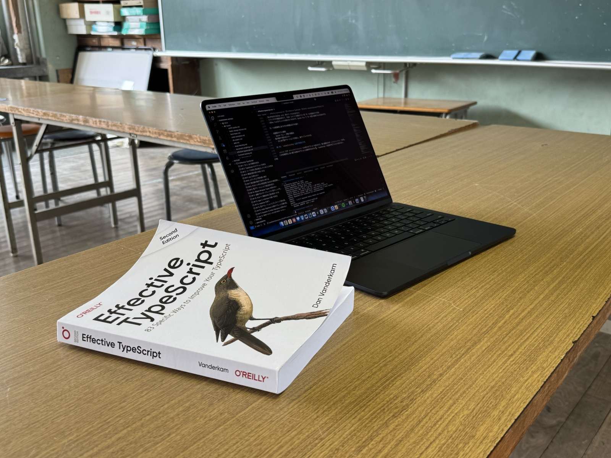

AIによりIT技術者が淘汰されるとか、プログラミング知識はもう役に立たないという言説もあるなか、「はいそうですか」となかば捨て台詞を吐きつつ読み進めていた[Effective TypeScript](https://blackwells.co.uk/bookshop/product/Effective-TypeScript-by-Dan-Vanderkam/9781492053743)をようやく読了した。

内容は以下のマークダウンにまとめている。AI成分が5%、残りの95%は人間が書いたので、AIの餌くらいにはなるだろう。

[Effective TypeScript | Yuuniworks Note](https://note.yuuniworks.com/books/effective-typescript)

知らないことがたくさんあり、読んでよかっと思う。特に以下辺りは明日からすぐに使える知識であった。

- Sec 7. 型は値の集合であると考える
- Sec 11. 過剰プロパティチェックと型チェックを区別する
- Sec 12. なるべく関数自体に型注釈をつける
- Sec 13. type と interface の違いを知る
- Sec 28. 型引数を省略するにはクラスやカリー化を使う
- Sec 35. String Type より詳細な型を使う
- Sec 37. オプショナルなプロパティを避ける
- Sec 49. 型のカバレッジを確認する
- Sec 56. 型がどのように表示されるかに気を配る
- Sec 61. 型とロジックを同期させるために Record を使う
- Sec 62. 可変長引数を扱うために Rest と Tuple を使う
- Sec 63. 排他的論理和の表現に never を使う
- Sec 64. Brand を使って Nominal Typing を実現する
- Sec 67. API に現れる型はすべて公開する
- Sec 70. 不要な型依存をなくすために最少限の型を複製する
- Sec 71. Module Argumentation を使って型を改善する

読み終わるのに普通に1ヶ月とかかかったけど、1日2日で読める人の頭の構造がどうなっているのか見てみたいと思うなどした。

余談だが、日本語翻訳されたO’Reilly本の読みづらさが昔から辛いと思っていたので、はじめて英語版を取り寄せて読んでみた。日本語で読むよりも認知負荷が少なく、写真撮ってAIに要約させたときの結果も非常に良かったので、今後はこのやり方を採用したい。

諸般の事情によりこのような場所で技術書を読む羽目になっているおじさんである