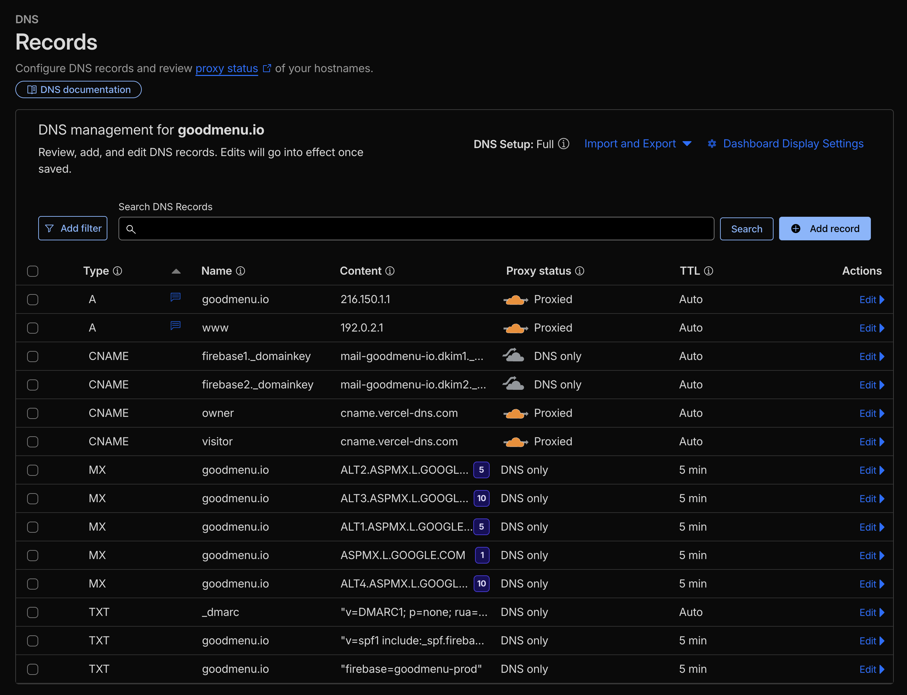
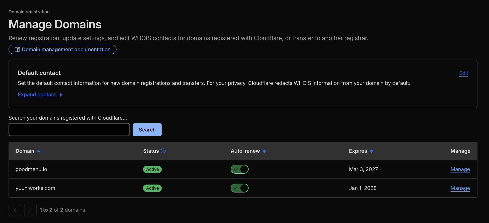
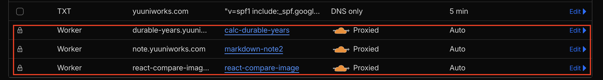

ドメインまわりの管理については、永らく [Namecheap](https://www.namecheap.com/) と [Route53](https://aws.amazon.com/jp/route53/) にお世話になってきたのだが、そろそろCloudflare教に入信しておかないと来世でひどい目に合うという噂を耳にしたため、レジストラ・DNSともにCloudflareに集約してみた。

## DNSの移行

まずはDNSをRoute53からCloudflareに移行した。なお、Route53はゾーンファイルをサクッと書き出せないため、[cli53](https://github.com/barnybug/cli53)というOSSを使ってゴニョゴニョして書き出したのち、Cloudflare側でインポートする必要がある。その後、レジストラであるNapecheapで移行ドメインのネームサーバーをCloudflareに切り替えたら完了。

DNSレコードの設定画面はこんな感じ。

ふむ。Route53の不思議なUIと異なり、サクサク使えそうなナウい見た目である。レコードごとにメモを書けるのが地味に嬉しい。別管理するの面倒なんだよね。あと、ゾーンファイルをUIからサクッとインポート & エクスポートできるのも花マル🌸です。Route53さんは見習っておくように。

Proxyってのが最初はどんな機能か分からなかったのだが、ようはリバースプロキシらしい。解決先のIPをCloudflareのリバプロサーバのIPに置き換えて、本来の解決先を隠すことができるみたい。さらにセキュリティやパフォーマンスの改善を[いい感じにやってくれる](https://developers.cloudflare.com/fundamentals/concepts/how-cloudflare-works/#cloudflare-as-a-reverse-proxy)ようだ。へぇー、便利。CNAMEレコードに追加しても大した意味はないだろうが、なんとなく有効にしておいた。

## レジストラの移行

NamecheapからCloudflareへのレジストラの移行も、UIの指示通りに行うだけで小一時間で完了した（ただし、かの悪名高いお◯◯ドット◯◯からの移管が同じようにスムーズに行くかどうかは不明ですのでご自愛ください）。ドメインの利用料がNamecheapより1割くらい安くなってうれしい。噂によると原価で売ってるらしい。強すぎる。

## 所感

ドメイン管理をCloudflareに集約したことで得られたわかりやすい恩恵としては、Cloudflare Workersで立ち上げたサイトに対してカスタムドメインを割り当てる際に、DNSレコードを自動でよしなにいじってくれるようになったことだ(編集不可の特殊なレコードが自動でセットされる)。これは楽だ。

今のところのCloudflareの個人的イメージは、Web標準 / 格安 / オールインワンである。このまま世界を制圧しそうな気がするので、今後は永らくお世話になったVercelから軸足をちょっとずつ動かしてみようかな、と思うなどした。
