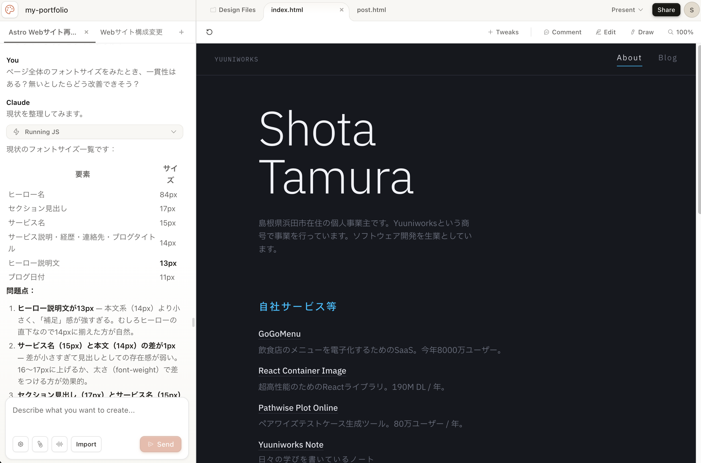

このポートフォリオサイトは、当初は8年前に[Gatsby](https://www.gatsbyjs.com/)で作り、3年前くらいにNotionベースの[Super](https://app.super.so/)に乗り換えて、いままでやってきた。

しかし、たいして更新もしないので、月に2,500円も払っているのが地味にもったいない。
そして、Notionほぼそのまま公開は、あまりに愛がなさすぎる。

Opus4.7に相談したところ「いまなら[Astro](https://astro.build/)がナウいっすよ」とのことなので、乗り換えてみた。

乗り換えるとはいうが、手作業で行うことはほとんどなく、90%はAI任せである。やったことはざっくり以下。

- Claude Design
  - 旧サイトのスクショ取り込み
  - リニューアルデザイン案の生成
  - デザイン微修正、壁打ち
  - HTMLとしてサンプルコード出力
- Claude Code Sonnet 4.6 & GPT-5.5
  - Astroの骨格コードを生成
  - Markdownファイルをはじめとする各種コンテンツの移行と調整
  - すべての新旧パスをマッピングして、リダイレクトを設定
  - 写真ズームとか、ダークモードとか、そういう細かい芸の実装

Astroという存在を認知してから仮移行が完了するまで、ほんの数時間である。
AI驚き屋もびっくりの速さだ。

そして、飽き性の自分は数年に一度、こうやってフレームワークを乗り換えていくクセがある。
そういうとき、あのUNIX界隈の格言を思い出す。
「データはASCIIで保存しろ、バイナリと印刷物はデータの墓場だ」的なやつ。
ほんと、ASCII(≒Markdown)しか勝たん。

↑Claude Design のAIに話しかける悲しき中年の図
